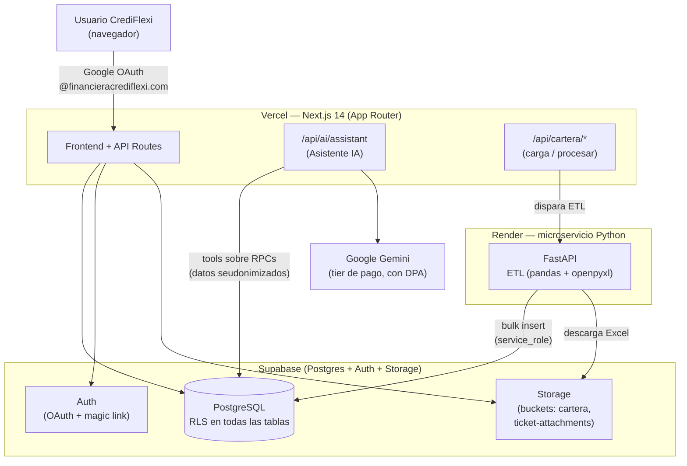
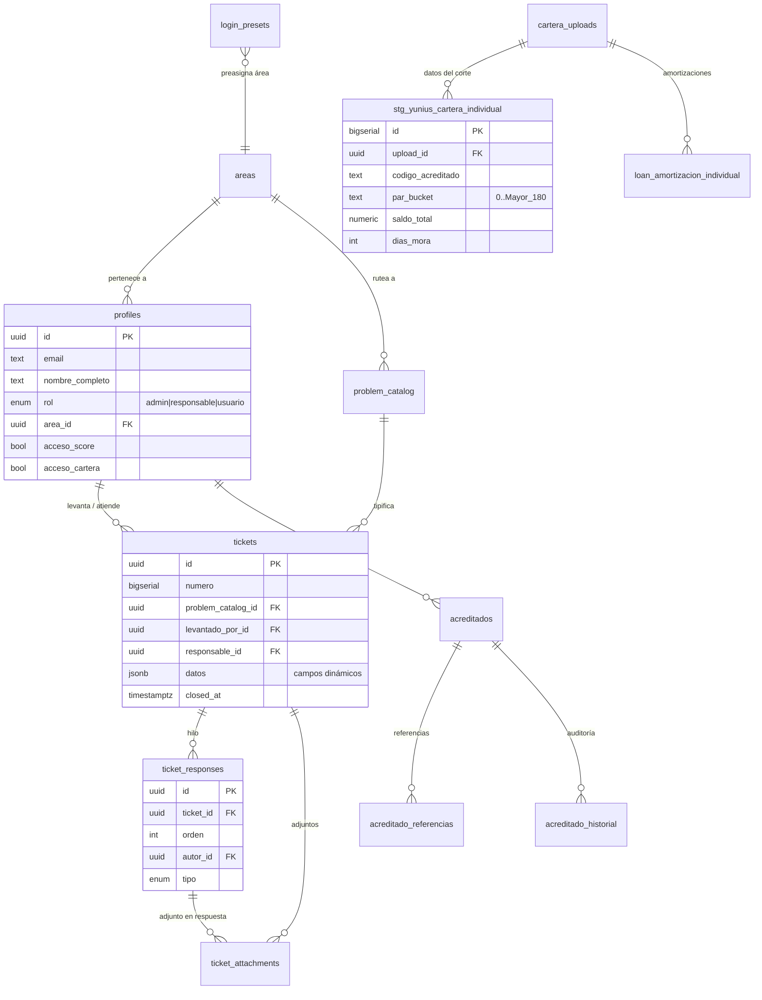

# Plataforma de Operaciones CrediFlexi — Presentación a Dirección

> Documento de apoyo para la junta con **Jesús Salazar (Director de Operaciones)**.
> Audiencia secundaria: Gerencia de Sistemas.
> Fecha: 2026-06-12.
> Énfasis solicitado: **costos, seguridad, manejo de datos del cliente, base de datos, arquitectura, mantenimiento.**

---

## 0. En una frase

Una plataforma interna que centraliza la operación de CrediFlexi en **4 módulos** (Tickets, Score, Cartera y Asistente IA), reemplaza progresivamente el Excel/legacy del automatizador, y corre **hoy sobre infraestructura real con costo de infra cercano a $0**.

---

## 1. Qué hay construido (Bloque A — demo en vivo)

| Módulo | Qué hace | Estado |
|---|---|---|
| **Tickets** | Mesa de ayuda interna: levantar, responder, rechazar con motivo, cerrar. Formularios con campos dinámicos por tipo de incidencia. | Producción (go-live con 3 tipos reales) |
| **Score Crediticio** | Captura de acreditados + referencias + evaluación del promotor, clasificación A/B/C/D. Réplica del modelo HM. | Producción |
| **Cartera Individual** | Carga de Excel → ETL → 5 dashboards (resumen ejecutivo, coordinación, recuperador, mora operativa, cohortes). | 5 dashboards vivos desde 2026-06-02 (ETL parcial) |
| **Asistente IA** | Chat que responde sobre la cartera consultando las **mismas cifras** de los dashboards, con permisos del usuario. | En migración a LLM real (Gemini) |
| **Admin** | Catálogos, áreas, usuarios, accesos por módulo, métricas. | Producción |

**Guion de demo sugerido (≈10 min):** levantar un ticket real (uno de los 3 tipos nuevos) → captura en Score → recorrido por dashboards de Cartera (resumen → coordinación → recuperador → mora → cohortes) → cierre preguntándole al Asistente IA una métrica en vivo.

**Hallazgos reales que la plataforma ya expone** (de la muestra de 215 créditos, corte 2026-05-30):
- PAR>30 global **34.52%**, PAR>90 **15.95%**, % mora **51.20%**.
- Coordinación más riesgosa: **Valle de Bravo** (44% PAR>30); más sana: **Metepec** (27%).
- Recuperador crítico identificado automáticamente (100% PAR>90) vs sano (Call Center 8.97%).

---

## 2. Cómo funciona técnicamente (Bloque B)

### 2.1 Arquitectura

**Resumen:** Next.js en **Vercel** (interfaz + lógica de servidor) + **Supabase** (base de datos, autenticación y almacenamiento) + un **microservicio Python en Render** que hace el procesamiento pesado de Excel (ETL de cartera) + **Gemini** para el asistente. Repos separados para que cada pieza se despliegue de forma independiente.

### 2.2 Base de datos (diagrama ER simplificado)

> Nota: hay **13 tablas** en total. El diagrama muestra las relaciones principales. La estructura completa está versionada en `supabase/migrations/` (34 migraciones).

**Manejo de versiones de la BD:** todo cambio de esquema es una **migración versionada** (Supabase CLI). Se aplica con un comando, es reproducible y queda en git. No hay cambios "a mano" en producción. Los tipos de TypeScript se **autogeneran** desde la BD (`database.types.ts`, 1112 líneas), lo que evita errores de desincronización entre código y base.

**Agregación en el servidor (RPCs):** los dashboards no descargan miles de filas al navegador; consultan **funciones `security definer`** que agregan en la base y devuelven JSON ya calculado:

| RPC | Devuelve |
|---|---|
| `cartera_resumen` | Totales + distribución PAR (8 buckets) + indicadores PAR>30/>90 |
| `cartera_por_coordinacion` | Riesgo por región |
| `cartera_por_recuperador` | Riesgo por cobrador |
| `cartera_mora_operativa` | Bandeja de morosos (seudonimizada para IA) |
| `cartera_cohort` | Comparativo de 2 cohortes por fecha de inicio de ciclo |

### 2.3 Seguridad y manejo de información del cliente *(la sección clave)*

**Acceso**
- Login **solo con dominio corporativo** `@financieracrediflexi.com` (se valida en el callback de OAuth; cualquier otro correo se desconecta).
- **Roles**: `admin`, `responsable`, `usuario` + **accesos por módulo** (`acceso_score`, `acceso_cartera`).
- **Row-Level Security (RLS) activado en TODAS las tablas**: cada usuario solo ve lo que le corresponde (sus tickets, su módulo). Un usuario sin acceso a cartera no puede leer cartera ni aunque llame directo a la base.

**IA y datos personales (PII)**
- Los datos de mora que ve el asistente van **seudonimizados**: código de acreditado, saldos y días de mora — **sin nombre ni teléfono**. Los RPCs agregados (resumen, coordinación, recuperador, cohorte) no exponen PII por diseño.
- **Gemini en tier de pago** (no el gratuito): bajo Data Processing Addendum, **no se entrena con nuestros datos**, solo logs breves anti-abuso. El tier gratuito de AI Studio sí entrena con los datos → **prohibido** con datos de la empresa.
- **Modo demo con datos sintéticos** (`AI_ASSISTANT_MOCK`) para presentaciones sin tocar PII real.
- Ruta de evolución si Cumplimiento lo exige: migrar a **Vertex AI** con *zero data retention* y *region pinning* (cambio de una línea con el AI SDK).

**El chat por dentro**
- Es un agente con *tool calling* sobre los **mismos RPCs** de los dashboards → mismas cifras, mismos permisos.
- **Guardrail central: nunca inventa cifras**; todo número sale de una herramienta y se cita con su `fecha_corte`.
- Límite de pasos por consulta para acotar costo y latencia.

**Brechas conocidas (transparencia) — bloqueantes del go-live de tickets con PII real**
- `ticket_attachments.insert` aún no valida participación en el ticket → **RLS-001**.
- `profiles_select` expone datos de perfil a todos los usuarios autenticados → **RLS-002**.
- Mutaciones de tickets aún ocurren desde el navegador (no Server Actions con validación de servidor) → **SEC-001**.
- Están **identificadas y priorizadas** como bloqueantes antes de meter PII real (ver §5).

### 2.4 Mantenimiento

- **Deploys automáticos por git**: push a `main` → Vercel y Render despliegan solos.
- **Migraciones reproducibles** + tipos autogenerados.
- **Serverless**: casi no requiere operación de Sistemas (no hay servidores que parchar).
- Único punto de atención operativa: el microservicio en Render Free "duerme" tras 15 min de inactividad (cold start ~20-30s), mitigable con un *wake-up* cada 10 min o subiendo a tier Standard ($7/mes).

---

## 3. Costos (Bloque B — sección dedicada)

> Infra **hoy ≈ $0/mes** con tiers gratuitos. El único costo variable real es Gemini, que es bajo por el bajo volumen.

| Servicio | Tier actual | Costo | Si escala |
|---|---|---|---|
| **Vercel** (frontend) | Free/Hobby | $0 | Pro ≈ $20/mes si crece el tráfico |
| **Supabase** (BD/Auth/Storage) | Free | $0 | Pro ≈ $25/mes (backups, más storage) |
| **Render** (microservicio ETL) | Free | $0 | Standard **$7/mes** (elimina cold start) |
| **Gemini** (asistente IA) | Pago, Nivel 1 (DPA) | ~$23-46 MXN/mes (medido) | Crece lineal: ~$0.04 MXN/pregunta (ver nota) |

**Cálculo del costo de Gemini**

Modelo: **Gemini 2.5 Flash**. Parámetros reales del código: system prompt con la base de conocimiento embebida (~4K tokens, se reenvía en cada paso), hasta 6 pasos por pregunta (`stepCountIs(6)`), y las herramientas devuelven JSON ya agregado de los RPCs.

*Costo por pregunta (**medido** con logs de tokens en producción):*

| Concepto | Tokens (promedio real) | Tarifa | Subtotal |
|---|---|---|---|
| Input (system prompt + historial + resultados de herramientas) | ~4,900 | $0.30 / 1M | $0.0015 |
| Output (respuesta + llamadas a herramientas) | ~370 | $2.50 / 1M | $0.0009 |
| **Total por pregunta** | ~5,300 | | **≈ $0.0024 USD ≈ $0.04 MXN** |

*Costo mensual según uso (22 días hábiles, 1 USD ≈ $17.50 MXN):*

| Escenario | Preguntas/día | Preguntas/mes | Costo/mes |
|---|---|---|---|
| Bajo (5 usuarios × 5 c/u) | 25 | ~550 | **~$23 MXN** |
| Medio | 50 | ~1,100 | **~$46 MXN** |
| Alto | 100 | ~2,200 | **~$92 MXN** |

*\* Cifras medidas con el log de consumo real (`onFinish` en la ruta del asistente), no estimadas. Tarifa Gemini 2.5 Flash: $0.30 input / $2.50 output por 1M tokens. La variable que más mueve el resultado es el número de preguntas/día.*

**Mensaje para Dirección:** medido con datos reales, el asistente cuesta **~$0.04 MXN por pregunta** → **~$23-46 MXN/mes** en uso interno realista (resultó ~4x más barato que el estimado inicial). El proyecto **no tiene costo de infraestructura significativo hoy**; los upgrades del resto del stack solo se justifican cuando el uso lo pida, no antes.

---

## 4. Estado vs v1.0 (qué está y qué falta)

**Listo:** ETL desplegado, microservicio LIVE en Render (smoke E2E real: 215 filas), 5 dashboards de cartera, RPCs de consulta, módulos Tickets/Score/Auth/Admin en producción, tipos regenerados. La carga ya es **trazable** (queda registrado quién sube y quién procesa cada reporte), la **fecha de corte se asigna sola** (día anterior, sin que el usuario la elija) y la llamada al microservicio va **autenticada** con token compartido.

**Pendiente para cerrar v1.0:**
- Endurecer RLS de tickets (RLS-001/002 + SEC-001) — **bloqueante por PII real**.
- Completar columnas del ETL (fechas de inicio de ciclo, garantías, amortizaciones).
- GitHub Action para `db push` en CI.

---

## 5. Lo que necesito de la junta (Bloque C — accionable)

1. **Confirmar los 3 tipos de incidencia** (FICHA NO REFLEJADA, CRÉDITO FALTANTE, ERROR EN MORA): campos exactos y responsables/áreas (Tesorería / Data Science).
2. **Validar la asignación de áreas** de todo el personal (presets ya cargados, pendientes de confirmar los casos dudosos).
3. **Visto bueno de Cumplimiento** para el manejo de PII en la IA (LFPDPPP, aviso de privacidad, secreto financiero) — define si el asistente puede exponer nombres/teléfonos a futuro.
4. **Prioridad de seguridad**: confirmar que cerramos RLS-001/002 + SEC-001 antes del uso diario con datos reales.

---

*Documento generado a partir de `PLAN.md`, `RESEARCH-CONSOLIDADO.md`, `package.json` y `supabase/migrations/`. Cifras de cartera = muestra real corte 2026-05-30 (215 créditos).*
